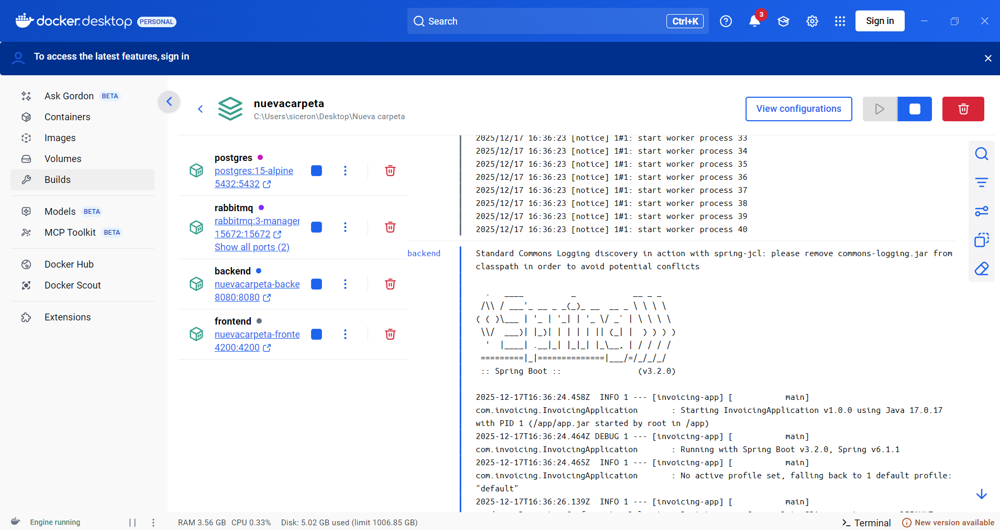

# Sistema de Facturación Dockerizado

Aplicación completa de facturación con autenticación JWT, CRUDs completos, generación de reportes PDF con JasperReports, mensajería con RabbitMQ, y funcionalidades de IA para recomendaciones y detección de anomalías.

## Arquitectura

- **Backend**: Spring Boot 3.2 (Java 17+)
- **Frontend**: Angular 17
- **Base de Datos**: PostgreSQL 15
- **Mensajería**: RabbitMQ
- **Reportes**: JasperReports
- **Autenticación**: JWT

## Características

### Funcionalidades Principales

1. **Autenticación y Autorización**
   - Login con JWT
   - Roles: ADMIN, USER
   - Protección de rutas en frontend y backend

2. **CRUD Completo**
   - Gestión de Clientes
   - Gestión de Proveedores
   - Gestión de Productos
   - Gestión de Facturas

3. **Facturación**
   - Formulario de factura con items dinámicos
   - Cálculo automático de subtotal, IVA y total
   - Validación de stock

4. **Reportes**
   - Generación de PDF de facturas con JasperReports
   - Descarga directa desde el frontend

5. **Mensajería (RabbitMQ)**
   - Evento `InvoiceCreated` al crear factura
   - Consumidor para actualización de stock
   - Consumidor para generación asíncrona de PDF

6. **Inteligencia Artificial**
   - Recomendaciones de productos basadas en historial del cliente
   - Detección de anomalías en montos de facturas
   - Score de riesgo y explicación

## Requisitos Previos

- Docker y Docker Compose
- Maven 3.9+ (para desarrollo local)
- Node.js 18+ (para desarrollo local del frontend)

## Instalación y Ejecución

### Opción 1: Docker Compose (Recomendado)

1. Clonar el repositorio:
```bash
git clone <repository-url>
cd invoicing-app
```

2. Ejecutar con Docker Compose:
```bash
docker-compose up -d
```

3. Acceder a la aplicación:
   - Frontend: http://localhost:4200
   - Backend API: http://localhost:8080
   - RabbitMQ Management: http://localhost:15672 (guest/guest)
   - Swagger UI: http://localhost:8080/swagger-ui.html

### Opción 2: Desarrollo Local

#### Backend

1. Asegúrate de tener PostgreSQL y RabbitMQ corriendo:
```bash
docker-compose up -d postgres rabbitmq
```

2. Compilar y ejecutar:
```bash
cd backend
mvn clean install
mvn spring-boot:run
```

#### Frontend

1. Instalar dependencias:
```bash
cd frontend
npm install
```

2. Ejecutar servidor de desarrollo:
```bash
npm start
```

## Usuarios Demo

- **Admin**: 
  - Username: `admin@demo.com`
  - Password: `Admin#123`

- **User**: 
  - Username: `user@demo.com`
  - Password: `User#123`

## Datos Demo

La aplicación incluye datos de prueba:
- 3 Clientes
- 2 Proveedores
- 5 Productos con stock

## Estructura del Proyecto

```
.
├── backend/
│   ├── src/
│   │   ├── main/
│   │   │   ├── java/com/invoicing/
│   │   │   │   ├── controller/     # Controladores REST
│   │   │   │   ├── service/        # Lógica de negocio
│   │   │   │   ├── repository/     # Repositorios JPA
│   │   │   │   ├── entity/         # Entidades JPA
│   │   │   │   ├── dto/            # Data Transfer Objects
│   │   │   │   ├── mapper/         # MapStruct mappers
│   │   │   │   ├── security/       # Configuración de seguridad
│   │   │   │   ├── config/         # Configuraciones
│   │   │   │   └── consumer/       # Consumidores RabbitMQ
│   │   │   └── resources/
│   │   │       ├── db/migration/   # Migraciones Flyway
│   │   │       └── reports/        # Plantillas JasperReports
│   └── pom.xml
├── frontend/
│   ├── src/
│   │   ├── app/
│   │   │   ├── components/         # Componentes Angular
│   │   │   ├── services/           # Servicios HTTP
│   │   │   ├── guards/             # Guards de rutas
│   │   │   ├── interceptors/       # Interceptores HTTP
│   │   │   └── models/             # Modelos TypeScript
│   └── package.json
└── docker-compose.yml
```

## API Endpoints

### Autenticación
- `POST /api/auth/login` - Login y obtención de JWT

### Clientes
- `GET /api/customers` - Listar clientes (con paginación y búsqueda)
- `GET /api/customers/{id}` - Obtener cliente
- `POST /api/customers` - Crear cliente
- `PUT /api/customers/{id}` - Actualizar cliente
- `DELETE /api/customers/{id}` - Eliminar cliente

### Proveedores
- `GET /api/providers` - Listar proveedores
- `GET /api/providers/{id}` - Obtener proveedor
- `POST /api/providers` - Crear proveedor
- `PUT /api/providers/{id}` - Actualizar proveedor
- `DELETE /api/providers/{id}` - Eliminar proveedor

### Productos
- `GET /api/products` - Listar productos
- `GET /api/products/available` - Listar productos disponibles
- `GET /api/products/{id}` - Obtener producto
- `POST /api/products` - Crear producto
- `PUT /api/products/{id}` - Actualizar producto
- `DELETE /api/products/{id}` - Eliminar producto

### Facturas
- `GET /api/invoices` - Listar facturas
- `GET /api/invoices/{id}` - Obtener factura
- `POST /api/invoices` - Crear factura
- `DELETE /api/invoices/{id}` - Eliminar factura
- `GET /api/invoices/{id}/report` - Descargar PDF de factura

### IA
- `GET /api/ai/recommendations?customerId={id}` - Obtener recomendaciones
- `GET /api/ai/anomaly-score?invoiceId={id}` - Detectar anomalías

## Funcionalidades de IA

### Recomendaciones de Productos
- Analiza el historial de compras del cliente
- Identifica productos frecuentemente comprados
- Sugiere productos similares en rango de precio (±20%)
- Muestra hasta 5 recomendaciones con razón

### Detección de Anomalías
- Calcula desviación del monto respecto al promedio histórico del cliente
- Genera un score de 0-1 (0 = normal, 1 = muy anómalo)
- Proporciona explicación del riesgo detectado
- Alerta cuando el score > 0.5

## Mensajería RabbitMQ

### Eventos
- **InvoiceCreated**: Se publica automáticamente al crear una factura

### Consumidores
1. **Stock Update Consumer**: Actualiza el stock de productos después de crear factura
2. **PDF Generation Consumer**: Procesa generación asíncrona de PDFs

## Pruebas

### Backend
```bash
cd backend
mvn test
```

### Frontend
```bash
cd frontend
npm test
```

## Tecnologías Utilizadas

### Backend
- Spring Boot 3.2
- Spring Security
- Spring Data JPA
- Spring AMQP (RabbitMQ)
- PostgreSQL
- Flyway (migraciones)
- JasperReports
- MapStruct
- JWT (jjwt)
- OpenAPI/Swagger

### Frontend
- Angular 17
- RxJS
- Reactive Forms
- HTTP Client

## Configuración

Las variables de entorno principales están en `docker-compose.yml` y `backend/src/main/resources/application.yml`.

### Variables Importantes
- `JWT_SECRET`: Clave secreta para JWT (debe ser al menos 256 bits)
- `DB_*`: Configuración de base de datos
- `RABBITMQ_*`: Configuración de RabbitMQ
- `CORS_ORIGINS`: Orígenes permitidos para CORS

## Notas de Desarrollo

- Las migraciones de base de datos se ejecutan automáticamente al iniciar la aplicación
- Los datos demo se cargan en la migración V2
- El frontend usa interceptores HTTP para agregar el token JWT automáticamente
- Los guards protegen las rutas que requieren autenticación

## Troubleshooting

### Error de conexión a base de datos
- Verificar que PostgreSQL esté corriendo
- Revisar variables de entorno en docker-compose.yml

### Error de CORS
- Verificar que `CORS_ORIGINS` incluya la URL del frontend
- Verificar configuración en `SecurityConfig.java`

### Error al generar PDF
- Verificar que el template `invoice.jrxml` esté en `src/main/resources/reports/`
- Verificar permisos de escritura


## Capturas





